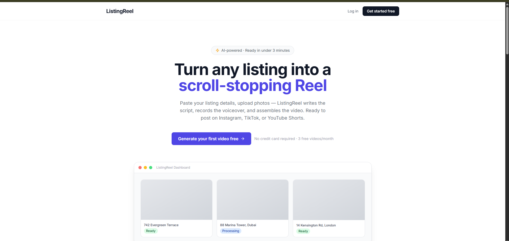
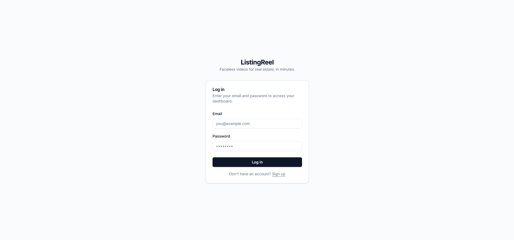
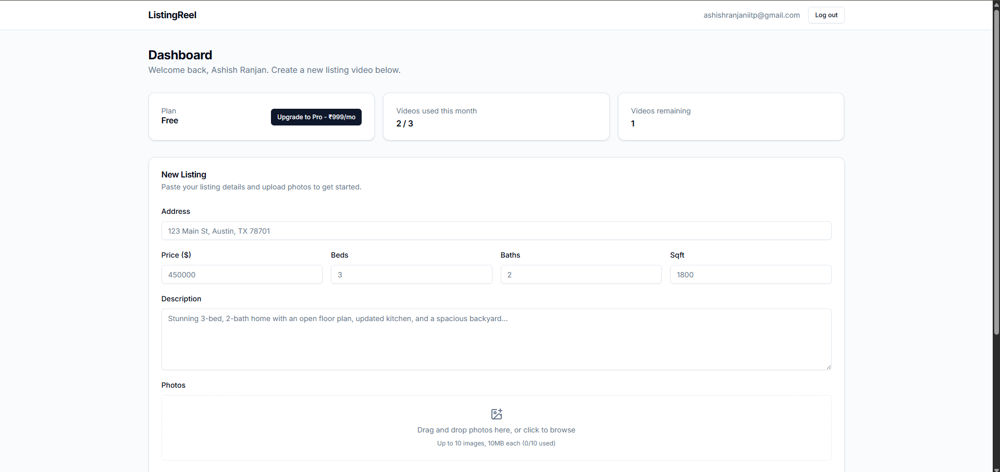
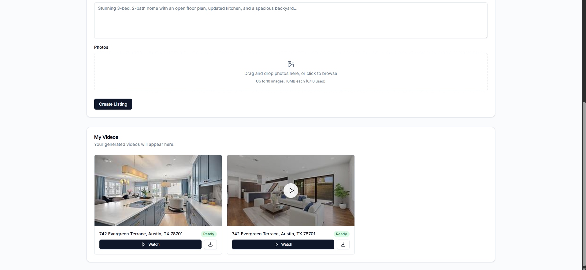
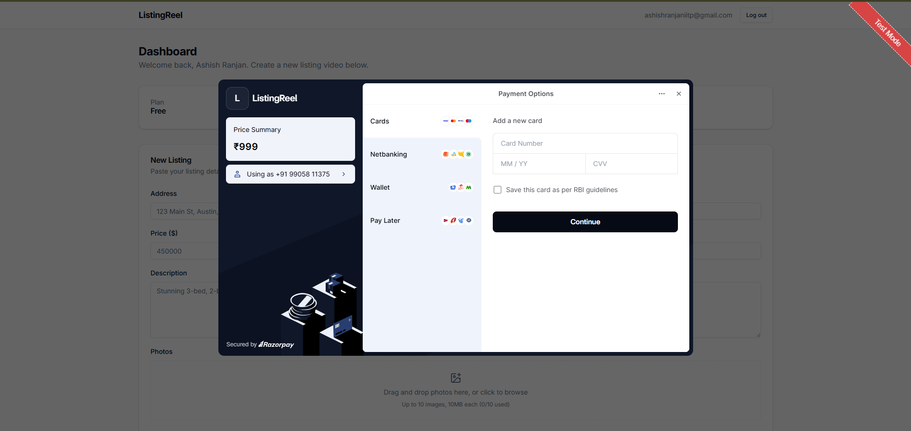

<div align="center">

# 🎬 ListingReel

### Turn any real estate listing into a scroll-stopping vertical video — in under 3 minutes, with zero editing.

[](https://listing-reel.vercel.app)
[](https://listingreel-backend.onrender.com/health)
[](#license)

[](https://nextjs.org/)
[](https://fastapi.tiangolo.com/)
[](https://supabase.com/)
[](https://www.typescriptlang.org/)
[](https://www.python.org/)
[](https://ffmpeg.org/)
[](https://groq.com/)
[](https://elevenlabs.io/)
[](https://razorpay.com/)

**[🚀 Live Demo](https://listing-reel.vercel.app)** · **[📖 API Docs](https://listingreel-backend.onrender.com/health)** · **[🐛 Report Bug](https://github.com/ashish6123/ListingReel/issues)**

</div>

<br/>

<div align="center">
  
</div>

<br/>

## ✨ What is ListingReel?

Real estate agents lose hours (or hundreds of dollars per listing) producing walkthrough videos for Instagram Reels, TikTok, and YouTube Shorts. **ListingReel automates the entire pipeline.**

Paste a listing's address, price, beds/baths, description, and a handful of photos — ListingReel handles the rest:

1. 🤖 **AI writes the script** — a punchy 30-second voiceover script tailored to that specific listing
2. 🎙️ **AI records the voiceover** — natural-sounding narration, not robotic TTS
3. 🎞️ **AI assembles the video** — photos animated with Ken Burns pan/zoom, synced to the voiceover, burned-in captions
4. 📲 **You download and post** — a ready-to-upload 1080×1920 vertical MP4

No camera. No editing software. No voice talent. No design skills.

> **Target market:** real estate agents in the US, UAE, and EU — markets where short-form video is already the dominant listing-marketing channel and agents are accustomed to paying for tools that save them time.

<br/>

## 📸 See it in action

<table>
<tr>
<td width="50%">

**Login**


</td>
<td width="50%">

**Dashboard**


</td>
</tr>
<tr>
<td width="50%">

**My Videos grid + inline player**


</td>
<td width="50%">

**Upgrade to Pro (Razorpay checkout)**


</td>
</tr>
</table>

<br/>

## 🔗 Live links

| | |
|---|---|
| 🌐 **Frontend** | [listing-reel.vercel.app](https://listing-reel.vercel.app) |
| ⚙️ **Backend API** | [listingreel-backend.onrender.com](https://listingreel-backend.onrender.com) |
| 💚 **Health check** | [listingreel-backend.onrender.com/health](https://listingreel-backend.onrender.com/health) |

> Note: the backend runs on Render's free tier, which spins down after 15 minutes of inactivity. The first request after idle time may take ~30–50 seconds while it wakes up.

<br/>

## 🧱 Tech stack

<table>
<tr><td><b>Frontend</b></td><td>Next.js 14 (App Router) · TypeScript · Tailwind CSS · shadcn/ui · sonner</td></tr>
<tr><td><b>Backend</b></td><td>FastAPI · Pydantic v2 · async background tasks · slowapi rate limiting</td></tr>
<tr><td><b>Database & Auth</b></td><td>Supabase (Postgres · Row Level Security · JWT auth · Storage)</td></tr>
<tr><td><b>AI script generation</b></td><td>Groq (Llama 3 — ultra-fast inference)</td></tr>
<tr><td><b>AI voiceover</b></td><td>ElevenLabs text-to-speech</td></tr>
<tr><td><b>Video assembly</b></td><td>FFmpeg — Ken Burns pan/zoom, caption burn-in, H.264/AAC export</td></tr>
<tr><td><b>Payments</b></td><td>Razorpay Orders API (HMAC-verified server-side)</td></tr>
<tr><td><b>Error tracking</b></td><td>Sentry</td></tr>
<tr><td><b>Hosting</b></td><td>Vercel (frontend) · Render (backend, Docker)</td></tr>
</table>

<br/>

## 🏗️ Architecture

```
┌─────────────┐         ┌──────────────┐         ┌─────────────┐
│   Next.js   │ ───────▶│   FastAPI    │ ───────▶│  Supabase   │
│  (Vercel)   │  HTTPS  │  (Render)    │         │ Postgres +  │
│             │◀─────── │              │◀────────│  Storage +  │
└─────────────┘   JSON  └──────┬───────┘         │    Auth     │
                                │                 └─────────────┘
                  ┌─────────────┼─────────────┐
                  ▼             ▼             ▼
            ┌─────────┐  ┌────────────┐  ┌─────────┐
            │  Groq   │  │ ElevenLabs │  │ FFmpeg  │
            │ (script)│  │ (voiceover)│  │ (video) │
            └─────────┘  └────────────┘  └─────────┘
```

**Request flow for video generation:**
1. Client creates a listing → stored in Supabase Postgres, photos in Supabase Storage
2. Client requests a script → FastAPI calls Groq, returns generated script
3. Client requests a voiceover → FastAPI calls ElevenLabs, uploads MP3 to Storage
4. Client triggers video generation → FastAPI kicks off a **background task**: downloads images + audio, runs FFmpeg to composite the final MP4, uploads it to Storage
5. Client polls `/api/video-status/{id}` every 3 seconds until `completed` or `failed`
6. Download link is a Supabase signed URL, expiring after 1 hour

<br/>

## 🚀 Features

- ✅ Email/password auth with JWT verification on every backend route
- ✅ Listing creation with up to 10 photos (drag-and-drop upload)
- ✅ AI script generation tailored to each listing's specifics
- ✅ Natural AI voiceover via ElevenLabs
- ✅ Automated video assembly with FFmpeg (pan/zoom transitions, burned-in captions)
- ✅ Real-time generation progress with animated step indicators
- ✅ Video card grid with thumbnails, status badges, inline video player, and download
- ✅ Free tier (3 videos/month, auto-resets monthly) + unlimited Pro tier
- ✅ Razorpay billing with HMAC signature verification
- ✅ Toast notifications for every async event, with retry on failure
- ✅ Production-hardened: rate limiting, CORS allowlisting, security headers (CSP/X-Frame-Options/etc.), structured request logging, Sentry error tracking

<br/>

## 🛠️ Local development

### Prerequisites
- Node.js 18+
- Python 3.11+
- FFmpeg installed locally
- A Supabase project
- API keys: [Groq](https://console.groq.com/), [ElevenLabs](https://elevenlabs.io/), [Razorpay](https://razorpay.com/) (test mode)

### Backend
```bash
cd backend
python -m venv venv
./venv/Scripts/activate   # Windows
# source venv/bin/activate  # macOS/Linux
pip install -r requirements.txt
cp .env.example .env       # fill in your keys
uvicorn app.main:app --reload --port 8000
```

### Frontend
```bash
cd frontend
npm install
cp .env.example .env.local  # fill in your keys
npm run dev
```

Visit `http://localhost:3000`.

<br/>

## 📦 Deployment

| Service | Platform | Why |
|---|---|---|
| Frontend | [Vercel](https://vercel.com) | Zero-config Next.js hosting, instant rollbacks |
| Backend | [Render](https://render.com) (Docker) | Persistent process required — FFmpeg + background tasks can't run on request-scoped serverless platforms |
| Database/Storage/Auth | [Supabase](https://supabase.com) | Managed Postgres + Storage + Auth in one |

See [`backend/Dockerfile`](backend/Dockerfile) for the production container definition.

<br/>

## 📁 Project structure

```
listingreel/
├── backend/
│   ├── app/
│   │   ├── routers/        # API endpoints (listings, script, voiceover, video, billing)
│   │   ├── services/       # External integrations (Groq, ElevenLabs, FFmpeg, Storage, Razorpay)
│   │   ├── models/         # Pydantic schemas
│   │   ├── main.py         # FastAPI app, middleware, CORS
│   │   └── config.py       # Environment settings
│   └── Dockerfile
└── frontend/
    ├── app/                # Next.js App Router pages
    ├── components/         # React components (listing form, video list, billing, etc.)
    ├── lib/                # Supabase client, API client
    └── types/               # Shared TypeScript types
```

<br/>

## 🗺️ Roadmap

- [ ] Stripe integration for US/EU/UAE billing (Razorpay is India-focused)
- [ ] Multiple voice and music options
- [ ] Email notification when a video finishes rendering
- [ ] Custom branding/watermark for agencies
- [ ] Multi-language script generation

<br/>

## 📄 License

MIT

<br/>

<div align="center">

Built by **[Ashish Ranjan](https://github.com/ashish6123)**

</div>
